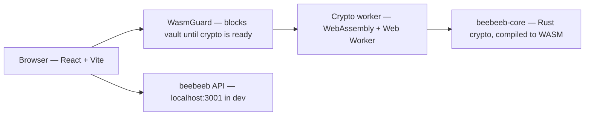

<p align="center">
  <a href="https://beebeeb.io"></a>
</p>
<h1 align="center">beebeeb web</h1>
<p align="center">The browser client for beebeeb. Files, names, and most metadata are encrypted in your browser before they reach the API.</p>
<p align="center"><strong>We can't recover your data. Not even if we wanted to.</strong> That's the point.</p>
<p align="center">
  <a href="https://github.com/beebeeb-io/web/actions/workflows/ci.yml"></a> &nbsp;
  <a href="LICENSE"></a> &nbsp;
   &nbsp;
  <a href="SECURITY.md"></a>
</p>
<p align="center"><a href="https://beebeeb.io">Website</a> &nbsp;·&nbsp; <a href="https://beebeeb.io/security">How it works</a> &nbsp;·&nbsp; <a href="SECURITY.md">Report a vulnerability</a></p>
<p align="center"><sub>End-to-end encrypted cloud storage, built in Europe. Operated by Initlabs B.V., Wijchen, Netherlands.</sub></p>

---

> _Screenshot coming._ <!-- TODO: add a drive-view screenshot to public/ and embed it here. -->

## What it is

The web app is where people sign in, unlock their vault, manage encrypted files and folders, create shares, review security settings, and manage billing. File content, file names, and most metadata are encrypted in the browser — through the Rust crypto core compiled to WebAssembly — before anything reaches the API. The server only ever stores ciphertext and operational metadata.

`WasmGuard` wraps protected routes and won't render vault features until the WebAssembly crypto module has loaded. In production builds the WASM binary is verified against the `wasm-sri.json` manifest generated by `gen-wasm-sri.mjs`.



## Quick start

Requires [Bun](https://bun.sh) and a running beebeeb API on `http://localhost:3001`. From the workspace root, bring up Postgres and the API:

```sh
docker compose up -d postgres
cd repos/server && cargo run -p beebeeb-api
```

Then, in the web repo:

```sh
bun install
bun dev          # http://localhost:5173
```

In development, `DevAuthGate` tries to auto-authenticate through `POST /dev/auto-login` (a debug-only server route). If it isn't available, the normal login flow is shown.

## Build & checks

```sh
bun run build        # tsc --noEmit && vite build && node gen-wasm-sri.mjs → dist/
bunx tsc --noEmit    # type-check
bunx playwright test # E2E (needs API on :3001 and dev server on :5173)
```

Docker images build from the **workspace root** as context, because the Dockerfile copies `repos/web`, `repos/core/beebeeb-wasm/pkg`, and `packages/shared`:

```sh
docker build -f repos/web/Dockerfile .
docker build -f repos/web/Dockerfile --build-arg VITE_API_URL=https://api.beebeeb.io .
```

Set `VITE_API_URL` to point the bundle at a non-default API. Test-account values (`BB_TEST_USER_*`) for Playwright live in a local `.env` — copy `.env.example` and never commit real credentials.

## Stack

React 19 · Vite 6 · TypeScript · Tailwind 4 · React Router 7 · Bun · Playwright. Crypto comes from `beebeeb-wasm` (the Rust core compiled to WebAssembly); shared UI and the API client come from `@beebeeb/shared`. Production is served by an Nginx container.

## Notable behaviour

- **Streaming upload** — `src/lib/encrypted-upload.ts` encrypts files chunk by chunk through the shared core primitive (`WasmChunkEncryptor`), never reading the whole file into memory. Each chunk is sealed in WASM and uploaded as a `nonce‖ciphertext‖tag` frame; an integrity check runs before the upload is completed.
- **Thumbnails** — generated client-side as WebP (`src/lib/thumbnail.ts`), encrypted with the file's own key, and cached locally via the Cache API so they survive reloads.

## Security

Found a vulnerability? Email **security@beebeeb.io** — see [SECURITY.md](SECURITY.md).

## Part of beebeeb

End-to-end encrypted, zero-knowledge cloud storage — made in Europe.
[core](https://github.com/beebeeb-io/core) · [cli](https://github.com/beebeeb-io/cli) · [web](https://github.com/beebeeb-io/web) · [mobile](https://github.com/beebeeb-io/mobile) · [desktop](https://github.com/beebeeb-io/desktop) · [website](https://beebeeb.io)

## License

[AGPL-3.0-or-later](LICENSE) — © Initlabs B.V. (KvK 95157565), Wijchen, Netherlands.
