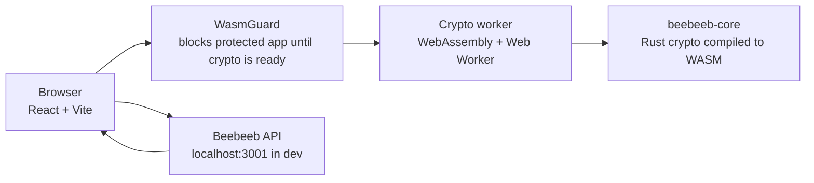

# Beebeeb Web

[](https://github.com/beebeeb-io/web/actions/workflows/ci.yml)
[](LICENSE)


Beebeeb Web is the browser client for Beebeeb, an end-to-end encrypted, zero-knowledge cloud storage product made in Europe and operated by Initlabs B.V. (KvK 95157565), Wijchen, Netherlands.

The web app is where users sign in, unlock their vault, manage encrypted files and folders, create shares, review security settings, and manage billing. File content, file names, and most metadata are encrypted in the browser before they reach the API. The server stores ciphertext and operational metadata.

Target launch: September 1, 2026.

## Tech Stack

| Area | Technology |
| --- | --- |
| UI | React 19 |
| Build tool | Vite 6 |
| Language | TypeScript |
| Styling | Tailwind CSS 4 |
| Routing | React Router 7 |
| Crypto runtime | `beebeeb-wasm` from `repos/core/beebeeb-wasm/pkg` |
| Shared client package | `@beebeeb/shared` from the workspace |
| Package manager | Bun |
| E2E tests | Playwright |
| Production serving | Nginx container built from `repos/web/Dockerfile` |

## Architecture



`WasmGuard` wraps protected routes and prevents the app from rendering vault features until the WebAssembly crypto module is loaded. In production builds, the WASM binary is verified against the `wasm-sri.json` manifest generated by `gen-wasm-sri.mjs`.

## Prerequisites

- Bun.
- Node.js, for scripts invoked by the build.
- A working Beebeeb API server on `http://localhost:3001`.
- The workspace packages available beside this repo:
  - `repos/core/beebeeb-wasm/pkg`
  - `packages/shared`
- Playwright browsers if you want to run E2E tests.

The local API dependency matters: most routes expect authenticated API calls, and the dev auth bypass calls `POST /dev/auto-login`, which only exists in debug server builds.

## Quick Start

From the workspace root:

```sh
docker compose up -d postgres
```

In another terminal:

```sh
cd repos/server
cp .env.example .env
cargo run -p beebeeb-api
```

In the web repo:

```sh
cd repos/web
bun install
bun dev
```

The Vite dev server listens on `http://localhost:5173`.

In development mode, `DevAuthGate` attempts to auto-authenticate through `POST /dev/auto-login`. If the endpoint is unavailable, the normal login flow is shown.

## Build for Production

Local production build:

```sh
cd repos/web
bun run build
```

Output is written to `dist/`. The build script runs:

```sh
tsc --noEmit
vite build
node gen-wasm-sri.mjs
```

Docker build from the workspace root:

```sh
docker build -f repos/web/Dockerfile .
```

The Dockerfile expects the workspace root as build context because it copies `repos/web`, `repos/core/beebeeb-wasm/pkg`, and `packages/shared`.

To override the API endpoint baked into the Vite bundle:

```sh
docker build -f repos/web/Dockerfile --build-arg VITE_API_URL=https://api.beebeeb.io .
```

## Environment Variables

The app reads Vite environment variables at build time and test-account values from local `.env` files.

| Variable | Required | Default | Purpose |
| --- | --- | --- | --- |
| `VITE_API_URL` | No | `http://localhost:3001` | API base URL used by the browser bundle. |
| `BB_TEST_USER_EMAIL` | E2E only | None | Test account email for Playwright helpers. |
| `BB_TEST_USER_PASSWORD` | E2E only | None | Test account password for Playwright helpers. |
| `BB_TEST_USER_RECOVERY_PHRASE` | E2E only | None | Recovery phrase used by tests that provision or unlock a vault. |

Copy `.env.example` to `.env` for local overrides. Do not commit real test credentials.

## Tests and Checks

Type-check:

```sh
cd repos/web
bunx tsc --noEmit
```

Production build check:

```sh
cd repos/web
bun run build
```

E2E tests:

```sh
cd repos/web
bunx playwright test
```

Playwright expects both the API server on `localhost:3001` and the Vite dev server on `localhost:5173` to be running. The config saves authenticated state under `playwright/.auth/user.json`.

## Repository Layout

| Path | Purpose |
| --- | --- |
| `src/app.tsx` | Route tree, providers, protected route wiring. |
| `src/components/wasm-guard.tsx` | Blocks protected UI until the crypto runtime is ready. |
| `src/components/dev-auth-gate.tsx` | Dev-only auto-auth wrapper. |
| `src/lib/api.ts` | API URL setup, token handling, and shared API exports. |
| `src/lib/key-context.tsx` | Vault key and crypto readiness state. |
| `src/workers/crypto.worker.ts` | WASM-backed crypto worker. |
| `e2e/` | Playwright tests. |
| `Dockerfile` | Production image build. |

## Security Notes

- The browser performs encryption and decryption locally through the Rust WASM package.
- `WasmGuard` prevents protected vault routes from rendering before the crypto runtime is ready.
- Share keys and vault keys must not be logged or committed.
- The dev auto-login path is dev-only and depends on debug server routes.
- Security reports should go to `security@beebeeb.io`.

## License

AGPL-3.0-or-later. See `LICENSE`.
