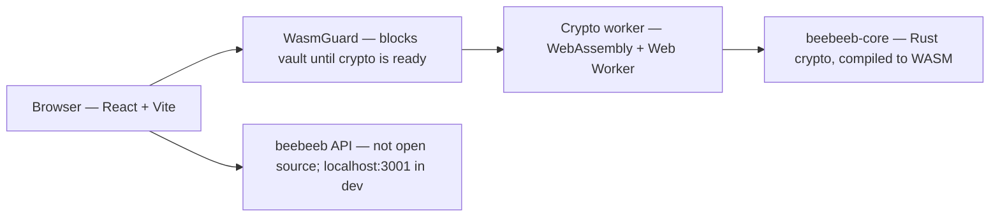

<p align="center">
  <a href="https://beebeeb.io"></a>
</p>
<h1 align="center">beebeeb web</h1>
<p align="center">The browser client for beebeeb. Files, names, and most metadata are encrypted in your browser before they reach the API.</p>
<p align="center"><strong>We can't recover your data. Not even if we wanted to.</strong> That's the point.</p>
<p align="center">
  <a href="https://github.com/beebeeb-io/web/actions/workflows/ci.yml"></a> &nbsp;
  <a href="LICENSE"></a> &nbsp;
   &nbsp;
  <a href="SECURITY.md"></a>
</p>
<p align="center"><a href="https://beebeeb.io">Website</a> &nbsp;·&nbsp; <a href="https://beebeeb.io/security">How it works</a> &nbsp;·&nbsp; <a href="SECURITY.md">Report a vulnerability</a></p>
<p align="center"><sub>End-to-end encrypted cloud storage, built in Europe. Operated by Initlabs B.V., Wijchen, Netherlands.</sub></p>

---

> _Screenshot coming._ <!-- TODO: add a drive-view screenshot to public/ and embed it here. -->

## What it is

The web app is where people sign in, unlock their vault, manage encrypted files and folders, create shares, review security settings, and manage billing. File content, file names, and most metadata are encrypted in the browser — through the Rust crypto core compiled to WebAssembly — before anything reaches the API. The server only ever stores ciphertext and operational metadata.

Use it live at [app.beebeeb.io](https://app.beebeeb.io) — no install needed. Native clients for
every platform are listed at [beebeeb.io/download](https://beebeeb.io/download).

`WasmGuard` wraps protected routes and won't render vault features until the WebAssembly crypto module has loaded. In production builds the WASM binary is verified against the `wasm-sri.json` manifest generated by `gen-wasm-sri.mjs`.


```mermaid
flowchart LR
    Browser["Browser — React + Vite"]
    Guard["WasmGuard — blocks vault until crypto is ready"]
    Worker["Crypto worker — WebAssembly + Web Worker"]
    Core["beebeeb-core — Rust crypto, compiled to WASM"]
    API["beebeeb API — not open source; localhost:3001 in dev"]

    Browser --> Guard --> Worker --> Core
    Browser --> API
```

## Quick start

Requires [Bun](https://bun.sh). Everything below runs in a plain clone of this repository:

```sh
git clone https://github.com/beebeeb-io/web.git
cd web
bun install
bun dev              # http://localhost:5173
```

The WebAssembly crypto module ships in this repo as the committed workspace package
`packages/beebeeb-wasm` (built from [core](https://github.com/beebeeb-io/core)), so no Rust
toolchain is needed to build or run the web client.

### About the API server

The beebeeb API server is **not open source**. The product clients (core, cli, web, mobile,
desktop) are public; the server is not. What that means for a contributor today:

- **You can** install, type-check, run the unit tests, build the production bundle, and run
  the dev server to work on the screens that render without an account, such as the
  sign-in and sign-up pages. Without an API they show "Could not reach the server"
  notices; that is expected.
- **You cannot yet** sign in from a local dev server. The dev bundle talks to
  `http://localhost:3001` (`VITE_API_URL` in `.env.development`), and the hosted API at
  `api.beebeeb.io` only accepts browser requests from beebeeb's own origins, so a dev
  server on `localhost:5173` cannot use it.
- **Full-stack end-to-end tests** (the Playwright specs under `e2e/`) need a real API
  server, so a plain clone cannot run them. Maintainers run the relevant specs against an
  internal API server before merging.

If you want to work on a signed-in flow, open an issue first and we will help you test it.

## Build & checks

```sh
bunx tsc --noEmit    # type-check
bun test             # unit tests (no server needed)
bun run build        # tsc --noEmit && vite build && node gen-wasm-sri.mjs → dist/
```

`bun run build` bakes `VITE_API_URL` into the bundle (see `.env.production`). Copy
`.env.example` to a local `.env` for Playwright test-account values (`BB_TEST_USER_*`) — never
commit real credentials.

### Internal (maintainers)

The production Docker image is built by beebeeb maintainers, not from a clone of this repo
alone: the `Dockerfile` expects beebeeb's internal workspace as its build context, and the
end-to-end runner (`e2e/scripts/web-e2e.sh`) needs a local API server binary. Contributors do
not need either. In development, `DevAuthGate` tries `POST /dev/auto-login`
(a debug-only route on a local API server) and falls back to the normal sign-in flow when it
is not there.

## Stack

React 19 · Vite 6 · TypeScript · Tailwind 4 · React Router 7 · Bun · Playwright. Crypto comes from `beebeeb-wasm` (the Rust core compiled to WebAssembly, committed at `packages/beebeeb-wasm`); shared UI and the API client come from `@beebeeb/shared`. Production is served by an Nginx container.

## Notable behaviour

- **Streaming upload** — `src/lib/encrypted-upload.ts` encrypts files chunk by chunk through the shared core primitive (`WasmChunkEncryptor`), never reading the whole file into memory. Each chunk is sealed in WASM and uploaded as a `nonce‖ciphertext‖tag` frame; an integrity check runs before the upload is completed.
- **Thumbnails** — generated client-side as WebP (`src/lib/thumbnail.ts`), encrypted with the file's own key, and cached locally via the Cache API so they survive reloads.

## Security

Found a vulnerability? Email **security@beebeeb.io** — see [SECURITY.md](SECURITY.md).

## Part of beebeeb

End-to-end encrypted, zero-knowledge cloud storage — made in Europe.
[core](https://github.com/beebeeb-io/core) · [cli](https://github.com/beebeeb-io/cli) · [web](https://github.com/beebeeb-io/web) · [mobile](https://github.com/beebeeb-io/mobile) · [desktop](https://github.com/beebeeb-io/desktop) · [website](https://beebeeb.io)

## License

[AGPL-3.0-or-later](LICENSE) — © Initlabs B.V. (KvK 95157565), Wijchen, Netherlands.
